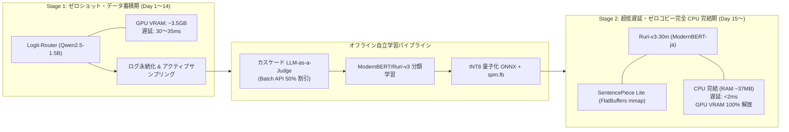

# Logit-Router 統合型自立 LLM プロキシのアーキテクチャ刷新と本番実装仕様

## 概要

プロンプト末尾の単一順伝播（Prefill のみ）から特定トークンのロジットを直接引き出して推論先を動的に決定する Logit-Router 機構は、自己回帰的なデコード処理を完全にスキップすることで、判定オーバーヘッドを従来の LLM-as-a-Judge（200〜600ms）から 30〜40ms 帯へと大幅に圧縮する高効率なアプローチである。

しかし、初期設計をそのまま本番環境に投入した場合、次のような重大な欠陥が顕在化する。

- リクエストごとの HTTP クライアント生成に伴うソケット枯渇（TIME_WAIT 滞留）
- FastAPI イベントループ上での PyTorch 実行に伴うスレッドブロッキング（GIL と CUDA 競合によるストリーミング遅延）
- SSE ストリーミング時のクライアント切断未検知による上流課金・KV スロットリーク
- 単純文字数スライスによるシステム指示欠落・プロンプト崩壊
- レスポンス生中継時の回答ログ収集漏れ（事後評価用データの欠損）
- ベンダー固有 API（Gemini/Claude 等）の非互換パラメータによる 400 エラー

本仕様書では、これら技術的負債を抜本解消するとともに、運用の無駄な中間ステップ（k-NN 等）を排除し、ゼロショットから極限の超低遅延・省リソース化へとダイレクトに至る「**2 段階進化ロードマップ（Two-Stage Flywheel Roadmap）**」を提示する。

- **Stage 1（立ち上げ・データ収集期）**: ゼロショット動作する Logit-Router（Qwen2.5-1.5B）で即時稼働
- **Stage 2（本格運用・完全 CPU 完結期）**: 蓄積データでファインチューニングした Ruri-v3-30m（ModernBERT-ja 基盤）＋ SentencePiece Lite Runtime による完全ゼロコピー・CPU 完結エンジン（1〜2ms、RAM ~37MB、GPU VRAM 占有ゼロ）

さらに、事後品質判定における「入力＋出力＋ユーザーシグナル」の 3 点突合パイプラインと、LLM-as-a-Judge のコスト爆発を物理的に防ぐ「3 層最適化戦略（サンプリング・カスケード・Batch API）」を統合し、本番運用に耐えうる堅牢な自立進化型プロキシ基盤を確立する。

---

## 1. 全体アーキテクチャと 2 段階進化ロードマップ

### 1.1 2 段階進化の基本方針（k-NN をスキップする理由）

初期検討にあった「k-NN セマンティック検索」は、意味的類似度（トピック）に引っ張られ「構文は平易だが論理的に難解なタスク」の難易度判定を誤りやすい点、およびインデックス管理コードが最終的に不要な負債となる点から正式に排除した。

Stage 1 で 1〜2 週間ログを収集すれば数百〜数千件の正解ラベル付きデータが揃うため、37M パラメータの極小モデルである Ruri-v3-30m であれば数分〜数十分で直接分類ヘッドをファインチューニングできる。



#### Stage 1: ゼロショット・データ蓄積期（Day 1〜Day 14）

- **バックボーン**: Logit-Router（Qwen2.5-1.5B-Instruct 等）
- **実行環境**: GPU（約 3〜4.5GB VRAM 占有）
- **判定遅延**: 約 30〜35ms
- **役割**: 自然言語の指示文に基づき、ラベル付きデータが存在しない初期状態からゼロショットでルーティングを実行。不確実性指標（エントロピー/マージン）と入出力・暗黙シグナルを SQLite/JSONL に漏れなく永続化する。

#### Stage 2: 超低遅延・ゼロコピー完全 CPU 完結期（Day 15 以降）

- **バックボーン**: ファインチューニング済み Ruri-v3-30m（Mean Pooling 分類ヘッド付き INT8 ONNX）＋ SentencePiece Lite Runtime
- **実行環境**: CPU（RAM 約 37MB、**GPU 占有ゼロ**）
- **判定遅延**: **1ms 未満〜2ms**
- **役割**: FlatBuffers メモリマップ（mmap）によるゼロコピー探索でトークナイズ遅延をマイクロ秒化し、INT8 量子化された 37M 極小モデルによって純粋な CPU 処理で瞬時に分類。プロキシが占有していた GPU VRAM をローカル推論基盤（vLLM）へ完全返還し、ローカル LLM の最大同時コンテキスト長とスループットを極大化する。

---

### 1.2 透過型プロキシ（Pass-through）の制御境界

プロキシ層では、オーバーヘッドの排除と OpenAI API の完全な前方互換性を維持するため、「原則スルー（バイパス）」の設計を徹底する。

#### スルー（非介入）とする領域
- **リクエストパラメータ**: `temperature`, `top_p`, `max_tokens`, `tools`（Function Calling）, `response_format`（JSON モード）などは、プロキシ側で厳密にパース・再構築せず、辞書データとしてそのまま上流へ転送する。
- **レスポンスストリーム**: 上流からの SSE チャンクは、JSON デシリアライズを行わず、生バイト列（bytes）のままクライアントへ即座にフラッシュ中継する。

#### プロキシが能動介入すべき必須防護策
- **非同期イベントループ保護（asyncio.to_thread / ProcessPool）**: PyTorch のテンソル計算およびトークナイズ処理をメインのイベントループから分離し、SSE ストリーミング中継のジッターを完全に防止する。
- **マルチターンコンテキストの安全な構築**: システムプロンプトを最優先で保護しつつ、末尾から順にトークン制限内で履歴を詰め込み、ルーター用決定プロンプトフォーマットを崩さない。
- **レスポンス本文の非同期バックグラウンド収集（Tee 方式）**: クライアントへの生バイト転送を妨げずに、ストリームから高速パーサーで生成テキストを抽出し、事後学習パイプライン用レコードに結合する。
- **宛先・認証の書き換え & ベンダー別サニタイズ**: Gemini の互換エンドポイント等でエラーを引き起こす固有パラメータ（例: `stream_options`, 不適合な `tool_choice`）を上流転送直前に安全に除去する。
- **クライアント切断（Abort）の能動遮断**: ストリーミング中継タスクと切断検知タスクを並行管理し、ユーザーが切断した際に上流接続を即座に破棄（`aclose()`）する。
- **自動フェイルオーバー**: 5xx エラーだけでなく、接続エラー（`ConnectError`）や初期タイムアウト（`ReadTimeout`）発生時に、即座に上位ルートへ切り替えて再送する。

---

## 2. 実運用における技術的課題と抜本的対策

| 項目 | 従来の課題 | 本仕様での抜本対策 |
| --- | --- | --- |
| **HTTP 通信** | コネクション毎に生成・破棄（TIME_WAIT 滞留、ポート枯渇） | `lifespan` で管理される単一 `httpx.AsyncClient` 持続的接続プール |
| **イベントループブロッキング** | メインスレッドでの PyTorch 実行によるジッター発生 | `asyncio.to_thread` による別スレッド実行 ＋ セマフォ並行制限 |
| **ストリーム切断** | クライアント中断時も上流生成が走り続け API 課金・KV 占有 | `request.is_disconnected()` 監視タスクと上流接続の即時強制破棄（`aclose()`） |
| **プロンプト構築** | 単純文字数スライスによる指示欠落やフォーマット崩壊 | システム指示固定保護 ＋ トークン単位での履歴逆順詰め込み |
| **事後評価用テキスト収集** | 生バイトスルー時に生成全文が記録できず Judge 不能 | ストリーミングチャンクを分岐（Tee）し、非同期でテキスト全文を再構成 |
| **ログ永続性** | stdout 出力のみでコンテナ再起動・ローテーション時に消失 | 非同期 QueueHandler 経由の SQLite / ローテーション JSONL 永続化 |
| **ベンダー非互換** | Gemini 等の独自パラメータエラー（400 頻発） | プラガブルなリクエストサニタイザー（`clean_request_for_vendor`） |

---

## 3. ルーティング数理機構とポリシー設計

### 3.1 Prefill Sliced LM-Head による高速判定

ルーターモデルの推論オーバーヘッドを最小化する鍵は、プロンプト処理後の自己回帰ループ（Decode）を完全に排除し、Prefill の最終隠れ層ベクトルから直接ロジットを抽出する点にある。

言語モデルの全語彙サイズ $V$ に対する線形変換を避け、選択肢インデックス $\mathcal{I} = \{i_A, i_B, i_C\}$ にスライスされた重み行列 $W_{\text{sliced}} \in \mathbb{R}^{3 \times d}$ を用いて内積を算出する。

$$
 z_k = W_{i_k}^{\top} h_T \quad (k \in \{A, B, C\})
$$

ここで $h_T \in \mathbb{R}^{d}$ はプロンプト末尾（位置 $T$）の最終隠れ層ベクトルである。これにより射影計算コストを大幅に削ぎ落とし、Prefill 全体のレイテンシを約 30〜35ms に安定化させる。

### 3.2 不確実性の定量化とエスカレーション判定

得られたロジットベクトル $z = [z_A, z_B, z_C]$ から温度パラメータ $\tau$ を介して事後確率分布 $P = [p_A, p_B, p_C]$ を算出する。

$$
 p_k = \frac{\exp(z_k / \tau)}{\sum_{j \in \{A, B, C\}} \exp(z_j / \tau)}
$$

モデル自体の判定確信度を評価するため、以下の 2 指標を算出する。

- **正規化シャノンエントロピー**:
  $$
   H_{\text{norm}}(P) = -\frac{1}{\ln(3)} \sum_{k \in \{A, B, C\}} p_k \ln(p_k) \quad (\in [0, 1])
  $$
- **トップロジットマージン**:
  $$
   \Delta z = z_{(1)} - z_{(2)}
  $$

#### エスカレーション判定ルール
1. **不確実性評価**: $H_{\text{norm}} > 0.35$ または $\Delta z < 0.80$ の場合、難易度判定に関わらず即座に **Route C（最上位商用モデル）** へエスカレーション。
2. **通常割り当て**: 不確実性が低い場合、$\arg\max_k (z_k)$ に従い A/B/C へディスパッチ。
3. **自動フェイルオーバー**: 選択先バックエンドが 5xx、タイムアウト、または接続拒否を返した場合、自動的に上位ルートへ再試行。

#### ルートの役割
- **Route A: ローカル推論基盤（vLLM / Ollama）**
  - 定型業務、単純分類、要約、日常会話、社外秘データ
- **Route B: 商用高速モデル（Gemini 1.5 Flash / GPT-4o-mini）**
  - 標準的なプログラミング、データ変換、多言語翻訳
- **Route C: 商用最上位モデル（Claude 3.5 Sonnet / GPT-4o）**
  - 高度な論理証明、複雑なアーキテクチャ設計、不確実性エスカレーションクエリ

---

## 4. データフライホイールと LLM-as-a-Judge コスト最適化

### 4.1 「入力＋生成結果＋暗黙シグナル」の 3 点突合評価

小型ルーターによる事後自己評価（自己言及バイアス）を排除し、オフライン環境で LLM-as-a-Judge を実行する。
入力プロンプトの文字面だけで難易度を決めつけず、以下の 3 点セットを評価器に与える。

1. **入力コンテキスト**: システムプロンプトおよびユーザー会話履歴
2. **実行情報 & 暗黙シグナル**: 割り振られたルート、モデル、初回トークン時間、ユーザー途中切断（Abort）や直後の再生成有無
3. **モデル生成回答テキスト**: 実際にストリーミング出力された全文

### 4.2 3 層コスト最適化戦略

全件を同期的に最上位モデルで評価すると月額数千ドルの赤字となるため、以下の 3 層防護を適用する。

1. **第 1 層: アクティブ・サンプリング（対象を全体の 5% に圧縮）**
   - $H_{\text{norm}} < 0.20$ かつ $\Delta z > 1.2$ であり、ユーザー中断や再生成がない確信度の高い正常クエリ（全体の約 95%）は、自動ラベリングとし Judge には送信しない。
   - 境界クエリ（$H_{\text{norm}} > 0.35$）、マージン微小クエリ、ユーザー再試行クエリ、エラー発生クエリ（全体の約 5%）のみを抽出。
2. **第 2 層: カスケード・ジャッジ（Tiered LLM-as-a-Judge）**
   - 抽出された 5% に対し、まず安価な `gpt-4o-mini` 等で 1 次判定。
   - 明確な合否（スコア 1, 2 または 5）はその場で確定し、グレーゾーン（スコア 3〜4）のみを `Claude 3.5 Sonnet` / `GPT-4o` へ昇格。
3. **第 3 層: Batch API の徹底活用（一律 50% 割引）**
   - 日次夜間バッチで OpenAI / Anthropic の Batch API を実行。月間ジャッジ費用を数千円（$15〜$30）に抑制する。

---

## 5. Ruri-v3-30m ＋ SentencePiece Lite による極限最適化（Stage 2）

Stage 2 では、収集したデータセットでファインチューニングした極小モデルを CPU 上で動作させる。

- **SentencePiece Lite Runtime**:
  - Google 公式の C++20 超軽量ランタイム（~50KB）。FlatBuffers 形式のモデルファイル（`spm.fb`）を mmap でゼロコピー参照。従来の SentencePiece より最大 10.8 倍高速、マイクロ秒単位でトークナイズ。
- **Ruri-v3-30m（ModernBERT-ja 基盤）**:
  - パラメータ数約 37M。JMTEB ベンチマークで高精度を誇る ModernBERT-ja を基盤とし、最大 8192 トークンの長文脈に対応。
  - Mean Pooling 出力に線形分類ヘッド（3 クラス）を接続し、INT8 量子化（約 37MB）。
  - **CPU 実行で 1ms 未満〜2ms の判定** を達成し、GPU VRAM を完全にローカル vLLM へ解放する。

---

## 6. ディレクトリ構成

```text
flywheel-pro/
├── app/
│   ├── __init__.py
│   ├── config.py             # 環境変数・閾値・接続プール設定
│   ├── logger.py             # 非同期 QueueHandler 構造化 JSON ログ基盤
│   ├── schemas.py            # OpenAI 完全互換スキーマ
│   ├── sanitizer.py          # ベンダー固有パラメータサニタイザー
│   ├── storage.py            # トランザクション永続化（SQLite / JSONL）
│   ├── engine/
│   │   ├── __init__.py
│   │   ├── base.py           # BaseRouterEngine 抽象基底クラス
│   │   ├── logit_router.py   # Stage 1: Qwen2.5-1.5B Sliced LM-Head エンジン
│   │   └── ruri_onnx.py      # Stage 2: Ruri-v3-30m + SentencePiece Lite CPU エンジン
│   └── main.py               # 透過プロキシ、lifespan、切断監視、Tee 回答収集、フェイルオーバー
├── pipeline/
│   ├── 01_extract_logs.py    # 境界ログのアクティブサンプリング（5% 抽出）
│   ├── 02_judge_eval.py      # カスケード式 LLM-as-a-Judge（Batch API 活用）
│   ├── 03_train_ruri.py      # ModernBERT-ja / Ruri-v3-30m 分類ヘッド学習
│   └── 04_export_onnx.py     # INT8 ONNX 量子化エクスポート & spm.fb 生成
├── models/
│   ├── router.onnx           # Stage 2 INT8 最適化分類モデル（~37MB）
│   └── spm.fb                # SentencePiece Lite 用 FlatBuffers トークナイザー
├── Dockerfile
├── docker-compose.yml
├── requirements.txt
└── .env
```

---

## 7. 本番対応リファレンス実装コード

### 7.1 設定管理（app/config.py）

```python
import os
from typing import Optional
from pydantic_settings import BaseSettings, SettingsConfigDict


class Settings(BaseSettings):
    model_config = SettingsConfigDict(env_file=".env", env_file_encoding="utf-8", extra="ignore")

    # ルーター設定: 'logit_router' (Stage 1) または 'ruri_cpu' (Stage 2)
    ROUTER_TYPE: str = os.getenv("ROUTER_TYPE", "logit_router")

    # Stage 1 設定
    ROUTER_MODEL_ID: str = "Qwen/Qwen2.5-1.5B-Instruct"
    ROUTER_DEVICE: str = "cuda"
    ROUTER_TORCH_DTYPE: str = "bfloat16"

    # Stage 2 設定
    RURI_ONNX_PATH: str = "models/router.onnx"
    SPM_FLATBUFFER_PATH: str = "models/spm.fb"

    # 判定閾値
    ENTROPY_THRESHOLD: float = 0.35
    MARGIN_THRESHOLD: float = 0.80

    # ルート宛先設定
    LOCAL_LLM_URL: str = "http://localhost:8000/v1"
    LOCAL_LLM_MODEL: str = "qwen2.5-14b-instruct"
    LOCAL_LLM_API_KEY: str = "EMPTY"

    COMMERCIAL_FAST_URL: str = "https://generativelanguage.googleapis.com/v1beta/openai"
    COMMERCIAL_FAST_MODEL: str = "gemini-1.5-flash"
    GEMINI_API_KEY: Optional[str] = None

    COMMERCIAL_EXPERT_URL: str = "https://api.openai.com/v1"
    COMMERCIAL_EXPERT_MODEL: str = "gpt-4o"
    OPENAI_API_KEY: Optional[str] = None

    # HTTP コネクションプール & タイムアウト
    HTTP_TIMEOUT_SECONDS: float = 120.0
    HTTP_CONNECT_TIMEOUT_SECONDS: float = 5.0
    HTTP_MAX_KEEP_ALIVE_CONNECTIONS: int = 100
    HTTP_MAX_CONNECTIONS: int = 200

    # 永続ストレージ
    DB_PATH: str = "data/transactions.db"


settings = Settings()
```

### 7.2 ベンダー固有サニタイザー（app/sanitizer.py）

```python
from typing import Any, Dict


def clean_request_for_vendor(route: str, payload: Dict[str, Any]) -> Dict[str, Any]:
    """各ベンダーの互換エンドポイントでエラーを引き起こす独自パラメータを除去・正規化する"""
    cleaned = dict(payload)

    # ルートごとにモデル名と認証を書き換えるためプロキシ側の引数を優先
    if route == "route_a":
        # vLLM 向け: stream_options 等の対応状況に応じて維持
        pass
    elif route == "route_b":
        # Gemini OpenAI 互換エンドポイント向けサニタイズ
        # stream_options は未サポートの場合があるため除去
        cleaned.pop("stream_options", None)
    elif route == "route_c":
        # OpenAI / Anthropic 向け
        pass

    return cleaned
```

### 7.3 ルーティングエンジン（app/engine/logit_router.py）

```python
import asyncio
import math
from typing import Any, Dict, List, Tuple
import torch
from transformers import AutoModelForCausalLM, AutoTokenizer
from app.config import settings
from app.schemas import ChatMessage


class LogitRouterEngine:
    """Stage 1: Prefill Sliced LM-Head によるゼロショットルーター"""

    def __init__(self):
        self.device = settings.ROUTER_DEVICE
        self.tokenizer = AutoTokenizer.from_pretrained(settings.ROUTER_MODEL_ID)
        self.model = AutoModelForCausalLM.from_pretrained(
            settings.ROUTER_MODEL_ID,
            torch_dtype=getattr(torch, settings.ROUTER_TORCH_DTYPE),
            device_map=self.device,
        ).eval()

        # 選択肢トークン ID (A, B, C)
        self.target_tokens = ["A", "B", "C"]
        self.token_ids = [self.tokenizer.encode(tok, add_special_tokens=False)[-1] for tok in self.target_tokens]

        # Sliced LM-Head 重みキャッシュ
        with torch.no_grad():
            self.sliced_head = self.model.lm_head.weight[self.token_ids, :].clone().detach()

        # 推論排他用セマフォ
        self._semaphore = asyncio.Semaphore(1)

    def _build_prompt(self, messages: List[ChatMessage], max_tokens: int = 2048) -> str:
        """システム指示と選択フォーマットを崩さず、履歴を安全にパッキングする"""
        system_content = "\n".join([m.content for m in messages if m.role == "system" and isinstance(m.content, str)])
        recent_msgs = [m for m in messages if m.role != "system"]

        # ルーター専用プロンプト指示
        system_instruction = (
            "You are an expert request router. Analyze the following conversation and classify the difficulty "
            "of the user's latest request into one of three routes:\n"
            "A: Simple, routine, summary, or everyday conversation (Local LLM)\n"
            "B: Standard programming, data transformation, translation, or structured reasoning (Fast Commercial LLM)\n"
            "C: Highly complex logical proof, difficult coding architecture, or subtle ambiguous task (Top Commercial LLM)\n"
            "Answer with ONLY a single letter: A, B, or C."
        )
        if system_content:
            system_instruction += f"\n\nContext Instructions:\n{system_content}"

        # 履歴を直近から遡ってトークン予算内で結合
        history_str = ""
        for m in reversed(recent_msgs[-6:]):
            text = m.content if isinstance(m.content, str) else ""
            line = f"[{m.role.upper()}]: {text.strip()}\n"
            if len(self.tokenizer.encode(line + history_str)) > (max_tokens - 500):
                break
            history_str = line + history_str

        formatted = (
            f"<|im_start|>system\n{system_instruction}<|im_end|>\n"
            f"<|im_start|>user\n{history_str.strip()}\n"
            f"Which route should handle this? Answer A, B, or C.<|im_end|>\n"
            f"<|im_start|>assistant\n"
        )
        return formatted

    def _sync_forward(self, prompt: str) -> Dict[str, Any]:
        """メインイベントループをブロックしないよう別スレッドで実行される同期推論"""
        inputs = self.tokenizer(prompt, return_tensors="pt").to(self.device)
        with torch.no_grad():
            outputs = self.model.model(**inputs)
            last_hidden = outputs.last_hidden_state[:, -1, :]  # [1, hidden_dim]
            logits = torch.matmul(last_hidden, self.sliced_head.T).squeeze(0)  # [3]
            probs = torch.softmax(logits, dim=-1).cpu().numpy().tolist()

        prob_dict = {"A": probs[0], "B": probs[1], "C": probs[2]}
        sorted_probs = sorted(probs, reverse=True)

        # エントロピー & マージン計算
        entropy = -sum([p * math.log(p) for p in sorted_probs if p > 1e-12]) / math.log(3)
        margin = sorted_probs[0] - sorted_probs[1]
        raw_choice = self.target_tokens[int(torch.argmax(logits))]

        # 不確実性エスカレーション
        escalated = False
        if entropy > settings.ENTROPY_THRESHOLD or margin < settings.MARGIN_THRESHOLD:
            final_route = "route_c"
            escalated = True
        else:
            final_route = f"route_{raw_choice.lower()}"

        return {
            "route": final_route,
            "raw_choice": raw_choice,
            "probs": prob_dict,
            "entropy": float(entropy),
            "margin": float(margin),
            "escalated": escalated,
        }

    async def determine_route(self, messages: List[ChatMessage]) -> Tuple[str, Dict[str, Any]]:
        prompt = self._build_prompt(messages)
        async with self._semaphore:
            # イベントループのジッターを防ぐためスレッドプールへオフロード
            metrics = await asyncio.to_thread(self._sync_forward, prompt)
        return metrics["route"], metrics
```

### 7.4 透過プロキシ本体・Tee 収集・切断遮断（app/main.py）

```python
import asyncio
from contextlib import asynccontextmanager
import json
import time
from typing import AsyncGenerator, Dict, Optional
import uuid

from fastapi import FastAPI, HTTPException, Request
from fastapi.responses import JSONResponse, Response, StreamingResponse
import httpx

from app.config import settings
from app.engine.logit_router import LogitRouterEngine
from app.logger import log_event, setup_logging, shutdown_logging
from app.sanitizer import clean_request_for_vendor
from app.schemas import ChatCompletionRequest, ModelCard, ModelListResponse

http_client: Optional[httpx.AsyncClient] = None
router_engine: Optional[LogitRouterEngine] = None


@asynccontextmanager
async def lifespan(app: FastAPI):
    global http_client, router_engine
    setup_logging()

    limits = httpx.Limits(
        max_keepalive_connections=settings.HTTP_MAX_KEEP_ALIVE_CONNECTIONS,
        max_connections=settings.HTTP_MAX_CONNECTIONS,
    )
    http_client = httpx.AsyncClient(
        limits=limits,
        timeout=httpx.Timeout(settings.HTTP_TIMEOUT_SECONDS, connect=settings.HTTP_CONNECT_TIMEOUT_SECONDS),
    )
    router_engine = LogitRouterEngine()

    yield

    await http_client.aclose()
    shutdown_logging()


app = FastAPI(title="Flywheel Pro Logit Proxy", version="2.1.0", lifespan=lifespan)


def resolve_backend_config(route: str):
    if route == "route_a":
        return settings.LOCAL_LLM_URL, settings.LOCAL_LLM_MODEL, settings.LOCAL_LLM_API_KEY
    elif route == "route_b":
        return settings.COMMERCIAL_FAST_URL, settings.COMMERCIAL_FAST_MODEL, settings.GEMINI_API_KEY
    else:
        return settings.COMMERCIAL_EXPERT_URL, settings.COMMERCIAL_EXPERT_MODEL, settings.OPENAI_API_KEY


async def stream_and_tee(
    response: httpx.Response,
    client_request: Request,
    trace_id: str,
    route: str,
) -> AsyncGenerator[bytes, None]:
    """クライアントへ生バイトをフラッシュ中継しつつ、切断検知と回答全文の非同期収集を行う"""
    collected_text_chunks = []
    finish_reason = "completed"

    try:
        async for chunk in response.aiter_bytes():
            # クライアントが切断した場合は即座に上流接続を遮断
            if await client_request.is_disconnected():
                finish_reason = "client_abort"
                await response.aclose()
                break

            yield chunk

            # バックグラウンド評価用に delta.content を簡易収集
            try:
                chunk_str = chunk.decode("utf-8", errors="ignore")
                for line in chunk_str.split("\n"):
                    if line.startswith("data: ") and not line.startswith("data: [DONE]"):
                        data = json.loads(line[6:])
                        delta = data.get("choices", [{}])[0].get("delta", {})
                        if "content" in delta and delta["content"]:
                            collected_text_chunks.append(delta["content"])
            except Exception:
                pass

    except Exception as e:
        finish_reason = f"error: {str(e)}"
        raise
    finally:
        await response.aclose()
        full_response_text = "".join(collected_text_chunks)
        # トランザクションレコード（事後品質判定用）を非同期記録
        log_event(
            "proxy.stream",
            "stream_completed",
            {
                "trace_id": trace_id,
                "route": route,
                "finish_reason": finish_reason,
                "response_text_length": len(full_response_text),
                "response_text": full_response_text,
            },
        )


@app.post("/v1/chat/completions")
async def chat_completions(req: ChatCompletionRequest, raw_request: Request):
    trace_id = str(uuid.uuid4())
    start_time = time.perf_counter()

    # 1. ルーティング判定
    route, metrics = await router_engine.determine_route(req.messages)
    decision_ms = (time.perf_counter() - start_time) * 1000

    log_event("proxy.router", "router_decision", {"trace_id": trace_id, "latency_ms": decision_ms, **metrics})

    # 2. 上流バックエンド解決 & ペイロードサニタイズ
    url, actual_model, api_key = resolve_backend_config(route)
    payload = req.model_dump(exclude_unset=True)
    payload["model"] = actual_model
    payload = clean_request_for_vendor(route, payload)

    headers = {"Authorization": f"Bearer {api_key}", "Content-Type": "application/json"}

    # 3. リクエスト送信（自動フェイルオーバー付き）
    async def send_upstream(target_url, target_payload, target_headers):
        req_upstream = http_client.build_request("POST", f"{target_url}/chat/completions", json=target_payload, headers=target_headers)
        return await http_client.send(req_upstream, stream=req.stream)

    try:
        upstream_resp = await send_upstream(url, payload, headers)
        if upstream_resp.status_code >= 500:
            raise httpx.HTTPStatusError("Server error", request=upstream_resp.request, response=upstream_resp)
    except (httpx.ConnectError, httpx.ReadTimeout, httpx.HTTPStatusError):
        # フェイルオーバー: Route C（最上位）へ切り替え
        url, actual_model, api_key = resolve_backend_config("route_c")
        payload["model"] = actual_model
        payload = clean_request_for_vendor("route_c", payload)
        headers["Authorization"] = f"Bearer {api_key}"
        upstream_resp = await send_upstream(url, payload, headers)

    if req.stream:
        return StreamingResponse(
            stream_and_tee(upstream_resp, raw_request, trace_id, route),
            media_type="text/event-stream",
        )
    else:
        resp_bytes = await upstream_resp.aread()
        return Response(content=resp_bytes, status_code=upstream_resp.status_code, media_type="application/json")


@app.get("/v1/models")
async def list_models():
    return ModelListResponse(data=[ModelCard(id="auto"), ModelCard(id="route_a"), ModelCard(id="route_b"), ModelCard(id="route_c")])
```

---

## 8. コンテナ構成と GPU リソース配分

```yaml
version: '3.8'

services:
  vllm-backend:
    image: vllm/vllm-openai:latest
    container_name: vllm-backend
    runtime: nvidia
    environment:
      - CUDA_VISIBLE_DEVICES=0
    volumes:
      - ~/.cache/huggingface:/root/.cache/huggingface
    ports:
      - "8000:8000"
    command: >
      --model Qwen/Qwen2.5-14B-Instruct-AWQ
      --quantization awq
      --dtype half
      --gpu-memory-utilization 0.80
      --max-model-len 4096
      --port 8000
    deploy:
      resources:
        reservations:
          devices:
            - driver: nvidia
              count: 1
              capabilities: [gpu]
    restart: unless-stopped

  logit-proxy:
    build: .
    container_name: logit-router-proxy
    depends_on:
      - vllm-backend
    ports:
      - "8080:8080"
    volumes:
      - ./data:/app/data
      - ./models:/app/models
    environment:
      - ROUTER_TYPE=logit_router
      - ROUTER_MODEL_ID=Qwen/Qwen2.5-1.5B-Instruct
      - LOCAL_LLM_URL=http://vllm-backend:8000/v1
      - LOCAL_LLM_MODEL=Qwen/Qwen2.5-14B-Instruct-AWQ
      - GEMINI_API_KEY=${GEMINI_API_KEY}
      - OPENAI_API_KEY=${OPENAI_API_KEY}
    deploy:
      resources:
        reservations:
          devices:
            - driver: nvidia
              count: 1
              capabilities: [gpu]
    restart: unless-stopped
```

---

## 9. 運用監視指標と SLO

| 指標名 | 目標 SLO / アラート閾値 | 監視目的 |
| --- | --- | --- |
| **ルーター判定レイテンシ** | Stage 1: p99 < 50ms, Stage 2: p99 < 2.5ms | ルーター自体のオーバーヘッド監視 |
| **クライアント TTFT** | p95 < 250ms（ローカル推論時） | キューイング遅延・スレッドブロックの検知 |
| **不確実性エスカレーション率** | 全リクエストの 10〜20% 以内 | 閾値の妥当性とルーティング精度の維持 |
| **クライアント切断遮断数** | 有意な中断発生を追跡 | 上流 API 課金および KV スロットの保護効果測定 |
| **自動フェイルオーバー発火数** | 1 時間あたり 0 件（平常時） | ローカル推論基盤の死活・障害検知 |

---

## 10. 参考文献・仕様

- **Logit-Router 推論機構**: Prefill Sliced LM-Head によるロジット直引き推論およびエントロピー・マージン定量化
- **Google SentencePiece Lite Runtime**: C++20 実装、FlatBuffers mmap によるゼロコピー・超高速トークナイズ（50KB ゼロ依存バイナリ）
- **cl-nagoya/ruri-v3-30m**: ModernBERT-ja 基盤の日本語特化極小エンコーダー（37M パラメータ、INT8 ~37MB）
- **FastAPI / ASGI Stream Cancellation**: `request.is_disconnected()` と `response.aclose()` による接続即時破棄とリソースリーク防止
