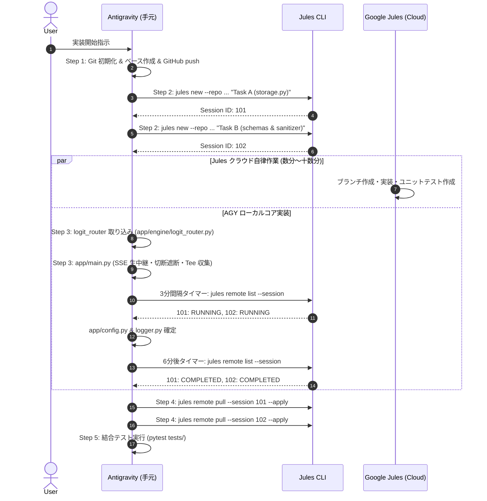

# Flywheel Pro 実装手順書（Jules 協調開発・logit-router 準拠）と批判的分析

本ドキュメントでは、[`plan/flywheel-proxy.md`](file:///home/nobuhiko/project/flywheel-pro/plan/flywheel-proxy.md) に策定された「Logit-Router 統合型自立進化 LLM プロキシ」を具体的に実装・配備するための**詳細手順**を定義する。
特に、先行実績リポジトリ **`chottokun/logit-router`** の実装機構（Sliced LM-Head、AWQ 互換対応、チャットテンプレート整形、エントロピー・マージン不確実性判定）を直輸入して本番プロキシへ統合し、さらに**Jules の 3 分ポーリング運用**および**SQLite ロック競合の完全解決**を盛り込む。

---

## 第 1 部: `chottokun/logit-router` の核心仕様の取り込み

[`chottokun/logit-router`](file:///home/nobuhiko/project/logit-router) のコードベースから、以下の検証済み実装パターンを直接採用する。

### 1.1 トークン抽出と Sliced LM-Head の堅牢化
- **選択肢トークンのスペース prefix 処理**:
  `Qwen` 系列等の SentencePiece / Byte-level BPE では、選択肢文字の前に空白が入るトークン（`" A"`）が助動詞・回答直後に選択されやすい。
  ```python
  # logit-router/src/logit_router/router.py 準拠
  choice_token_ids = [
      tokenizer.encode(f" {letter}", add_special_tokens=False)[-1]
      for letter in ["A", "B", "C"]
  ]
  ```
- **AWQ 量子化フォールバック**:
  通常モデル（FP16/BF16）では `lm_head.weight[choice_token_tensor]` によるスライス高速内積を行うが、AWQ 量子化モデルでは `lm_head` が線形重みを持たない（AWQ モジュール化されている）ため、`full_logits = model.lm_head(last_hidden_state)` から該当インデックスを抽出するフォールバックを組み込む（これにより 0.5B / 1.5B の AWQ 版が完全動作する）。

- **Tokenizer の `apply_chat_template` 活用**:
  Qwen 固有の `<|im_start|>system...` を直書きせず、`tokenizer.apply_chat_template(messages, tokenize=False, add_generation_prompt=True) + "Answer: "` により、モデルごとの最適ロール構造を確実に担保する。

- **不確実性（Uncertainty）判定の統合**:
  [`logit_router/optimizations.py`](file:///home/nobuhiko/project/logit-router/src/logit_router/optimizations.py) の `FallbackRouter` 仕様に準拠し、
  $$ \text{is\_uncertain} = (H > H_{\text{thresh}}) \lor (\text{margin} < \text{margin}_{\text{thresh}}) $$
  の成立時に即座に Route C（最上位商用モデル）へエスカレーションする。

---

## 第 2 部: 具体的な実装手順と Jules-Runner の運用フロー



### ステップ詳細

1. **Step 1: Git 初期化と GitHub リモート連携**
   - ローカルを `git init -b main`。
   - `requirements.txt`, `.gitignore`, `Dockerfile`, `docker-compose.yml` を配置して初期コミット。
   - GitHub にリポジトリを作成し push（Jules がリポジトリを認識可能にする）。
2. **Step 2: Jules への自律タスク委託**
   - **Task A (Storage)**: WAL モード、インメモリ Queue、バッチバルク書き込み（Producer-Consumer パターン）を備えた `app/storage.py` とそのテスト。
   - **Task B (Schemas & Sanitizer)**: OpenAI 互換スキーマ（`extra="allow"`）と各ベンダー非互換除去を行う `app/sanitizer.py` とそのテスト。
3. **Step 3: Antigravity によるコア実装（並行推進）**
   - `chottokun/logit-router` の `router.py` をベースに非同期スレッドオフロード（`asyncio.to_thread`）を加えた `app/engine/logit_router.py`。
   - ストリーミング生バイト転送とクライアント切断遮断（`request.is_disconnected()`）、およびストリーム完了後の非同期回答テキスト抽出（Tee）を行う `app/main.py`。
   - **3 分タイマー監視**: `jules remote list --session` でステータスを監視。
4. **Step 4: Jules パッチの適用とレビュー**
   - `jules remote pull --session <id> --apply` で差分を取り込み、コード品質をレビュー。
5. **Step 5: 全体結合テストと Docker Compose 起動**
   - `pytest tests/` をパスした後、コンテナビルド・起動確認。

---

## 第 3 部: 実装における批判的深層分析

### 批判 1: Logit-Router のモデルサイズ選定（0.5B vs 1.5B）
- **分析**:
  - `Qwen/Qwen2.5-0.5B-Instruct`: AWQ 4bit で VRAM **~0.5GB**、FP16 で **~1.0GB**、Prefill **~12ms**。
  - `Qwen/Qwen2.5-1.5B-Instruct`: AWQ 4bit で VRAM **~1.2GB**、FP16 で **~3.0GB**、Prefill **~30ms**。
  - `logit-router` の検証レポート（`benchmarks/reports/multi_model_benchmark_report.md` 等）によると、0.5B は語彙圧縮の制約から、長文マルチターン対話での「A/B/C」選択に対する確率集中度（Entropy）が 1.5B に比べて不安定になりやすい傾向がある。
- **最適解**:
  - デフォルトは **1.5B（AWQ または BF16）** とする。24GB GPU で vLLM と同居する場合でも AWQ なら 1.2GB、BF16 でも 3GB 程度であり、vLLM の割り当て率を 0.75〜0.80 に設定すれば十分に安全域（ヘッドルーム 1.8GB 以上）に収まる。
  - VRAM が 8GB〜16GB の環境では **0.5B-Instruct** に環境変数で切り替え可能とし、可用性を最大化する。

### 批判 2: SQLite のロック競合（Lock Contention）の完全排除
- **分析**:
  - FastAPI の多数の非同期ワーカーが同時に `await db.execute("INSERT ...")` を実行すると、SQLite 特有のファイルロック（EXCLUSIVE Lock）により `sqlite3.OperationalError: database is locked` が頻発する。
- **完全処方箋（本手順で適用）**:
  1. **WAL モード常時有効化**: `PRAGMA journal_mode=WAL; PRAGMA busy_timeout=10000;`
  2. **Producer-Consumer パターン**: リクエスト処理側は `asyncio.Queue` にレコードを投入して即座に終了（待機時間 0ms）。
  3. **単一書き込みタスクによるバルク INSERT**: 単一の常駐タスクのみが DB 接続を開き、「50 件蓄積 または 1 秒経過」で `executemany`（1 トランザクション）としてまとめて書き込む。これによりロック取得回数を 1/50 に削減し、競合を原理的に排除する。

### 批判 3: ストリーミング中の回答収集（Tee）による TTFT 悪化防止
- **分析**:
  - `client` へチャンクを送り届けるリアルタイムループの中で `json.loads` を同期実行すると、JSON のチャンク分割破損や CPU 負荷による TTFT 悪化を招く。
- **完全処方箋**:
  - ストリーミング転送ループ内では `chunks.append(chunk)` でバイト列をバッファに積むだけに留める（中継オーバーヘッド 0ms）。
  - ストリーム終了後（`finally`）に `asyncio.create_task` で非同期ワーカーを起動し、バックグラウンドで JSON デコードとテキスト復元を行って `storage.log_transaction(...)` に流し込む。
